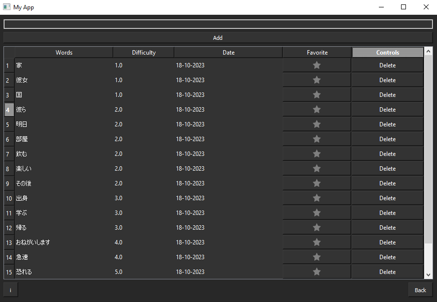
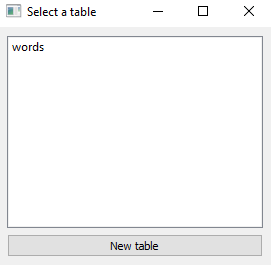

<p align="center">  
  
</p>

<h1 align="center">AnkiVocabHelper</h1>

The Anki Vocabulary Helper is a free tool designed to assist learners in expanding their vocabulary in foreign languages. It leverages the wordfreq python library to assess the difficulty of foreign words. The application aids in determining which words should be added to Anki next. Typically, learners prefer to start with words that are easier, more common, and frequently used. This is where wordfreq library comes into play - it evaluates the complexity of words, allowing users to prioritize learning words based on their difficulty level.



The primary purpose of this application is to facilitate the tracking of new words for users, particularly those who use Anki for learning languages. 

By using this application, learners can streamline their vocabulary learning process and focus on the most relevant words first.

## Getting Started

To get started with this project, follow these steps:

1. Clone this repository to your local machine.
```
git clone https://github.com/kuronekozero/AnkiVocabHelper.git
```
2. Navigate to the `gui` folder in project directory.

3. Run main.exe file.

That's it!
Optionally you can create a shortcut of main.exe and put it on your desktop for quicker access.

Also for some reason it may tell you that this program may be a virus. No idea how to fix it... In earlier versions of this program everything worked fine.

## Running the Application

To run the application, simply execute the built exe file. You can add new tables and words to assess their difficulty and review them later. 
After adding some words just sort the table by difficulty.



## Supported Languages

- **English**
- **Spanish**
- **German**
- **Japanese**
- **Korean**
- **Chinese**
- **Franch**
- **Arabic**
- **Russian**
- **Czech**
- **Hebrew**
- **Polish**
- **Swedish**
- **Norwegian**
- **Dutch**
- **Italian**
- **Bengali**
- **Portuguese**
- **Catalan**

And 20 more languages!

You can check the full list of supported languages on wordfreq's page: 
<a href="https://pypi.org/project/wordfreq/">Wordfreq library page.</a>

PS: I removed slovak and slovenian because this 2 languages didn't work properly for some reason, sorry;( 

Ukranian coming soon.

## Development Updates

### Fixes and Improvements

- ~~**Issue 1**: Fix sorting order.~~ (Completed)
- ~~**Issue 2**: Fix upper case lower case problem.~~ (Completed)
- **Issue 3**: Fix sorting words by date.
- **Issue 4**: Fix colors of tables menu.  

### Planned Additions and Changes

- ~~**Addition/Change 2**: Add option to add sentences of phrases.~~ (Completed)
- ~~**Addition/Change 1**: Add other languages support.~~ (Completed)
- ~~**Addition/Change 3**: Add option to create more than one table.~~ (Completed)
- ~~**Addition/Change 4**: Add stars near each word so the word will be in priority while sorting.~~  (Completed)

## Some additional information

### How to delete tables?
Well...:point_right::point_left: I never really managed to add the delete button to the "List of tables" window. But I'll try to add it in the future. For now just go to `gui` folder and delete any table you don't want from there.

## Tips 
1. To add a new word you can just press ENTER after typing the word, you don't have to click "add" all the time.
2. If you want to add more than one word at ones you can just write the list of words that you want ot add devided by ",". The program will rate each word separately.
3. You can sort words in each direction from the simplest to the most difficult and in the opposite way by just clicking twice on the "difficulty" button.
4. The word's difficulty varies from 1 to 10. If you are getting the word with number 11 that means that the API doesn't have this word. It happens very rare, usually with some very unpopular words, slang or some VERY simple words(like "What" for example(idk why really...))

## License

This project is licensed under the MIT License.
